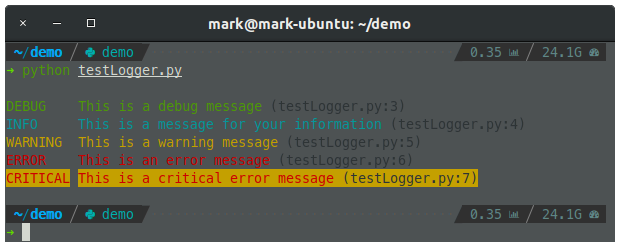

# Python Package: markkk

Convenient Python utilities for personal usage

## Install

```bash
pip install --upgrade markkk
```

## Usage

### Sub-module: `logger`

This is a pre-configured logger using python's built-in `logging` module and a formatter [`colorlog`](https://github.com/borntyping/python-colorlog). It is easy to use, simplest setup on earth, suitable for personal day-to-day debugging, personal small-scale projects.

The logger has three logging handlers:

1. log to file `logs/debug.log` which captures **all** logs with timestamp.
2. log to file `logs/error.log` which captures **error & critical** logs with timestamp.
3. log to console **with colors** for different logging levels.

Note:

-   A new folder named `logs` will be created at the current working directory if not already exist.
-   `debug.log` & `error.log` file will also be created if not already present under `logs`.

_Example_:

```python
from markkk.logger import logger

logger.debug("This is a debug message")
logger.info("This is a message for your information")
logger.warning("This is a warning message")
logger.error("This is an error message")
logger.critical("This is a critical error message")

```



### Sub-module: `time`

-   `timeit` (this is a decorator for your function)
-   `timeitprint` (this is a decorator for your function)

_Example_:

```python
from markkk.time import timeitprint

@timeitprint
def tictok():
    a = 1000000
    for i in range(10000000):
        a -= 1
        b = a
    return

if __name__ == "__main__":
    tictok()
```

_Console output_:

```
====== Func 'tictok' finished in 0.3280000000 secs ======
```

### Sub-module: `file`

-   `safe_rename`
-   `safe_copy`
-   `safe_move`

### Sub-module: `encoding`

-   `is_ascii`
-   `check_non_ascii_index`
-   `is_ascii_only_file`
-   `check_file_by_line`
-   `ensure_no_zh_punctuation`
-   `replace_punc_for_file`

_Example_:

```python
from markkk.encoding import replace_punc_for_file, is_ascii

replace_punc_for_file("test.txt")
is_ascii("。") # this returns false
```

## Development

### Install package using local version

_clone this repo_

```bash
git clone https://github.com/MarkHershey/python-utils.git
```

_go to project root_

```bash
cd markkk
```

_create virtual env for this project_

```bash
python3 -m venv venv
source venv/bin/activate
pip install --upgrade pip setuptools  wheel
pip install -r requirements.txt
```

_install this package in editable mode_

```bash
pip install -e .[dev]
```

### Run Unittest

_at project root_

```bash
tox
```

## License

-   [MIT License]("LICENSE")
